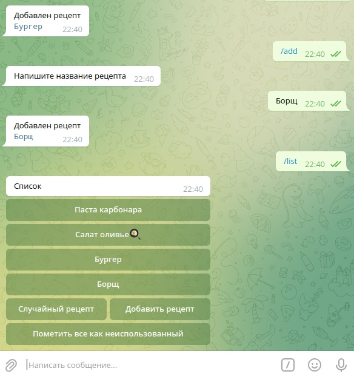

# random-recipes-bot
Preview:

# requirements
* `.env` file
* `poetry`

# Roadmap

## ALPHA 1: working mvp app
- [X] All commands via `/<command>`, not via messages.
- [X] Tooltips with commands
- [X] Create callback validation condition `try/except`
- [X] Validate callback function
- [X] Inline button *use* in recipe details menu.
- [X] Inline buttons *Choose random*, *Add*, *Unuse all* in recipes list menu.

## ALPHA 2: module refactoring
- [X] Put all strings into constant.
- [X] Modules, functions, beautifull
- [X] Poetry

## BETA 1: single thread app
- [X] Rework logic of the bot. Remove unnecessary features, duplicate features.
- [X] Handling all kinds of exceptions (For example for clock on already deleted recipes)

## BETA 2: async app
- [X] Async bot
- [X] Async mongo

## BETA 3: final refactoring
- [ ] Documentation
- [ ] Naming
- [ ] Tests
- [ ] Logging

## REALISE 1:
- [ ] Welcome message
- [ ] Hosting

# FEATURES:
- [X] Docker
- [ ] Change names of commands:
    - [ ] `list` not just a list, but also actions on recipes.
- [ ] recipes pagination
- [ ] The ability to share a recipes
    - [ ] Random
    - [ ] List